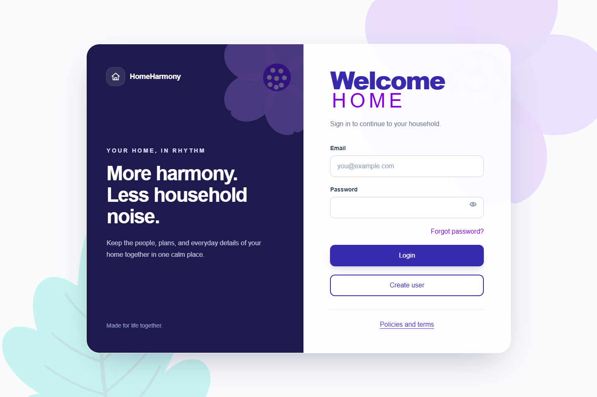
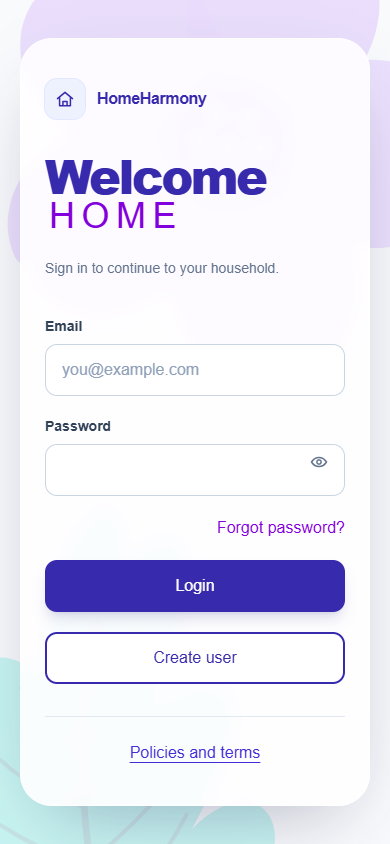
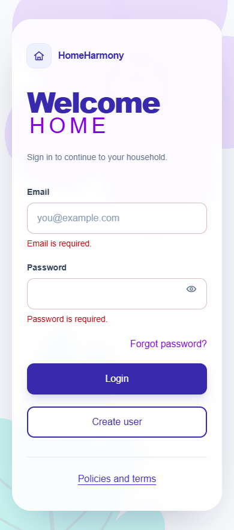
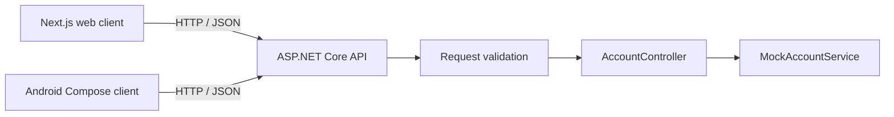

# HomeHarmony

A household planner growing from a real need: keeping shared calendars, chores, and everyday responsibilities in sync. I'm building it to use at home and to deepen my experience across ASP.NET Core, Next.js, and native Android development.

## Current status

**Early development · mock login implemented on web and Android · September 2026.**

Both clients call the same API and navigate to a placeholder home screen after a successful demo login. This checks fixed credentials only: it creates no authenticated session, cookie, or token, and the home screen is not protected. No database is required to run the current application.

| Implemented | Planned |
| --- | --- |
| Responsive web login and native Compose login | Real accounts with ASP.NET Core Identity |
| Email/password validation, password visibility, loading state | Registration, password recovery, sessions and tokens |
| Field errors, invalid-credentials feedback, transient network/server errors | Households, shared calendars, chores and reminders |
| Shared `POST /api/account/login` contract | SQL Server persistence and real-time updates |
| API unit/integration tests, web and Android unit tests, GitHub Actions CI | Self-hosted deployment and a Google Play release |

Create user, forgot password, and policies/terms controls are placeholders. Privacy and self-hosting are project goals; a production deployment is still future work.

## Screenshots

The running web login, captured in Microsoft Edge. The narrow views show the responsive web application at phone width.

| Web at phone width | Required-field validation |
| --- | --- |
|  |  |

## Stack

| Part | Technology |
| --- | --- |
| API | C#, .NET 10, ASP.NET Core controllers, DataAnnotations, OpenAPI |
| Web | Next.js 16 App Router, React 19, TypeScript, Tailwind CSS 4 |
| Android | Kotlin, Jetpack Compose / Material 3, ViewModel, Navigation Compose, Retrofit / Gson |
| Tests | xUnit + `WebApplicationFactory`, Vitest, JUnit + coroutine tests |
| Automation | GitHub Actions builds and tests for all three applications |

## Architecture at a glance

The API is organized by feature. Web form state and Android ViewModel state stay in their clients; the API owns request validation and the mock credential check. There is no persistence layer yet. Read the short [current architecture](docs/arch/current-architecture.md) for the implemented boundaries and request flow.

## Explore the repository

- [`api/`](api) — ASP.NET Core API and xUnit tests.
- [`web/`](web) — responsive Next.js client and Vitest tests.
- [`mobile/`](mobile) — native Android client and JVM tests.
- [Current architecture](docs/arch/current-architecture.md) — a short map of what runs today.
- [Design journey](docs/arch/arch_design_journey_as_september_10th.md) — the longer historical reasoning and evolving direction.
- [Account decisions](docs/arch/account-login.md) — validation rules and future authentication direction.
- [Project goals](docs/about-the-project.md), [local setup](docs/dev/local-setup.md), and [Git/GitHub setup](docs/dev/github-setup.md).

## License

Open source under [GNU AGPL-3.0](LICENSE).
