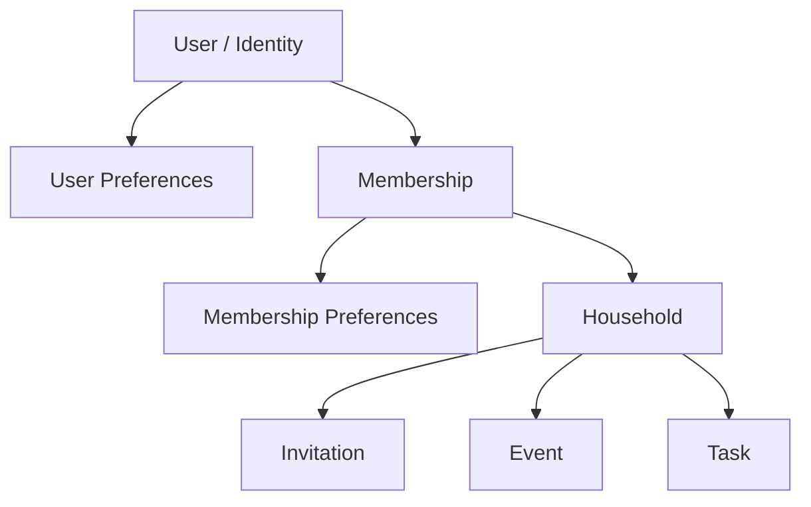
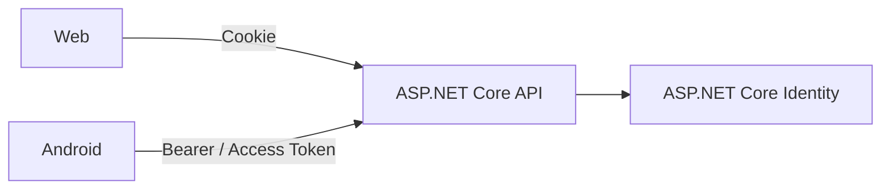
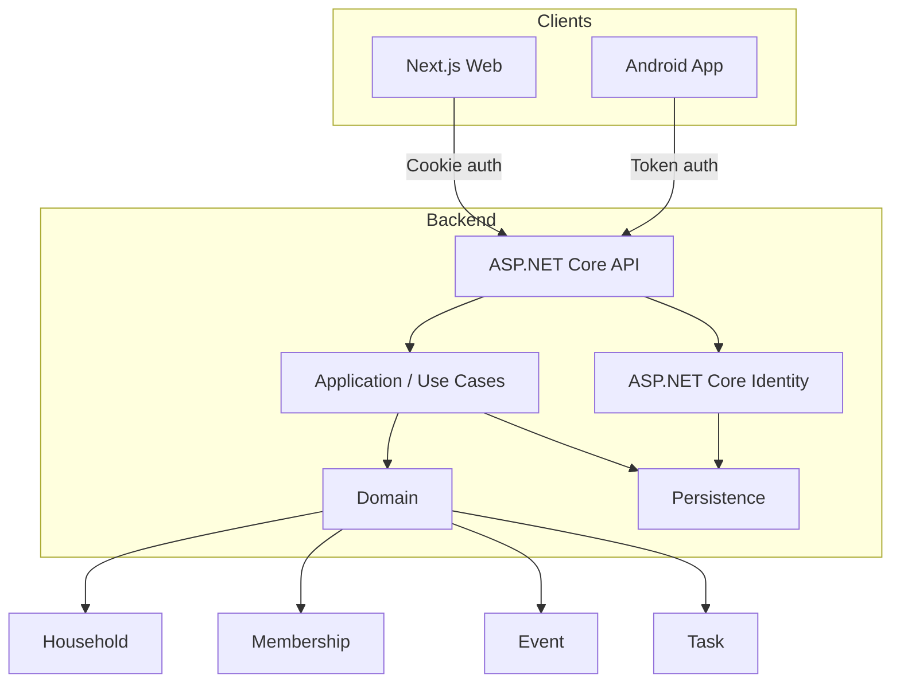
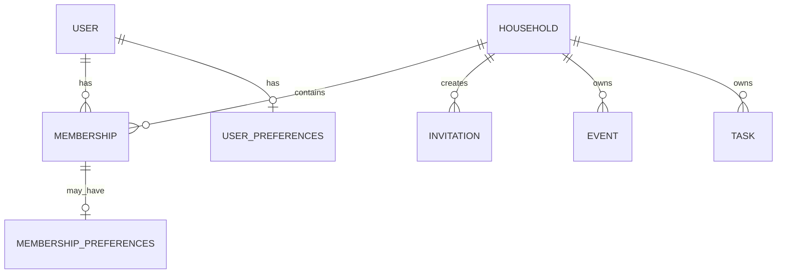
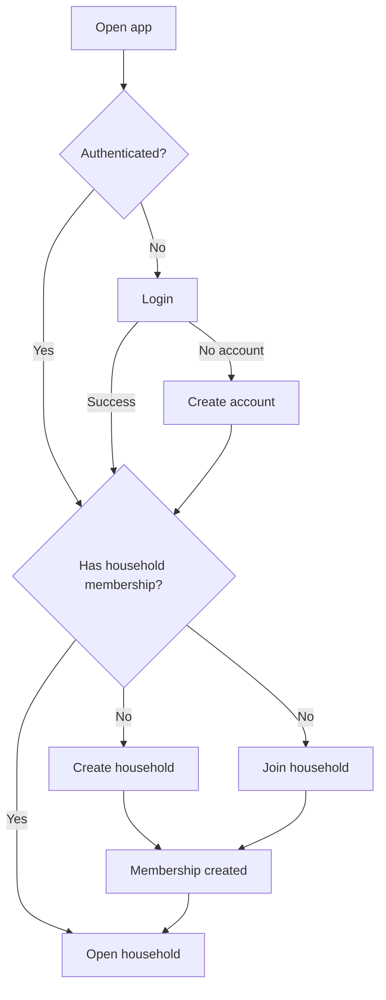

# HomeHarmony — Architecture & Design Journey

> Working architecture notes extracted from handwritten planning, implementation reviews, and project decisions.
>
> This is intentionally not a polished “final architecture” document.  
> It keeps the reasoning, changes, wrong turns, and decisions that shaped the current design.

---

# 1. Why I am building it this way

HomeHarmony started as a household/shared-calendar idea, but the project is also a way to practice designing a system from end to end:

- API first, but not API in isolation.
- Web and Android as real clients.
- Domain decisions before locking the database model.
- Mock flows before full backend implementation.
- Security and ownership considered early.
- Keep the architecture simple until complexity is justified.
- Prefer one complete vertical slice over many half-designed features.

The main goal is not to invent the most advanced architecture possible.

The goal is to understand why each part exists.

---

# 2. How my thinking evolved

My first notes were mostly about:

- actions;
- screens;
- API calls;
- persistence;
- CRUD;
- what data should exist.

Then the questions started to change.

Instead of only asking:

- What endpoint do I need?
- What table do I need?
- What object should I return?

I started asking:

- How far does `User` go?
- Does this information belong to the user or only to the user's membership in a household?
- Is this really CRUD?
- Should an operation trigger more domain work?
- Is this object important enough to exist independently?
- What should the client know, and what should the API decide?
- What should be decided now, and what should wait until the real backend exists?

That shift is important.

The domain started becoming clearer from the user flows rather than from the database.

---

# 3. Development approach

The working pattern that emerged:

1. Think through the user action on paper.
2. Identify objects and relationships.
3. Define the API contract needed by the client.
4. Mock the API behavior.
5. Implement the client flow.
6. Implement the second client.
7. Review the complete vertical slice.
8. Revisit contracts and assumptions.
9. Only then move toward the real backend implementation.

For the login slice this became roughly:

```text
Mock API
   ↓
Android login
   ↓
Web login
   ↓
Review complete slice
   ↓
Correct contracts / validation / structure
   ↓
Real authentication + persistence later
```

This exposed problems earlier than implementing the full backend first would have.

---

# 4. Early system view

The first architecture thinking was straightforward:

```text
Client
  ↓
API
  ↓
Application / domain logic
  ↓
Persistence
```

The early notes already included:

- GET/POST requests;
- JSON responses;
- authentication state;
- local persistence/cache;
- data ownership;
- privacy;
- deletion;
- server-side processing;
- multiple clients;
- possible concurrency issues.

At this stage the architecture was still mostly technical.

The domain model was not yet settled.

---

# 5. Login as the first workflow

The first user flow explored in detail was login.

Initial questions:

- User opens the app.
- Is there already a valid login/session?
- If yes, continue.
- If no, show authentication options.
- What happens if the person is not yet a user?
- What happens after account creation?
- Does the user create a household or join one?
- What information must be available immediately after authentication?

Early simplified flow:

```text
Open app
   ↓
Check authentication
   ├── valid → enter app
   └── missing/invalid
          ↓
        Login
          ↓
     account exists?
       ├── yes → authenticate
       └── no  → registration/onboarding
```

The login work quickly became more than a login screen.

It exposed:

- identity;
- account creation;
- onboarding;
- household creation;
- invitations;
- memberships;
- persistence;
- client-specific authentication.

---

# 6. Account / User / Identity

At first I was thinking in broad terms of `User`.

That was too vague.

The later direction is clearer:

- authentication identity is one concern;
- application/domain information is another;
- household-specific information should not automatically be stored on the user.

The project will use ASP.NET Core Identity for user management.

Reasoning:

- familiar technology;
- configurable;
- handles a lot of security-sensitive behavior already;
- avoids building authentication infrastructure from scratch.

The authentication mechanism is client dependent:

```text
Web
  → Identity cookie / browser session

Android
  → token-based authentication
```

The API remains the same system, but the way the client proves its identity differs.

---

# 7. Login contracts — how the decision changed

## Earlier idea

I originally introduced a custom `LoginResponse`.

It was useful while mocking because the client needed a simple result.

That made sense for the slice, but it started becoming artificial once ASP.NET Identity was considered.

## Review

I asked:

- what does the response actually own?
- is authentication state really part of my custom response?
- will Web and Android even receive authentication in the same way?

Answer: not really.

## Current decision

`LoginResponse` should be removed.

ASP.NET Identity should own the authentication result:

- Web receives/uses the authentication cookie.
- Android receives the token response required for token authentication.

Shared application/user information can be returned separately when needed.

This removes a contract that existed mainly because the mock needed it.

That is a good example of the mock doing its job: it helped build the flow, then became disposable.

---

# 8. Login request identity

An early login contract used a generic username-style field.

During review I decided the application should use email addresses for login.

So the contract should express that directly.

```text
LoginRequest
- EmailAddress
- Password
```

Validation exists at more than one level:

```text
Client
  → fast feedback / format checks

API
  → authoritative validation
```

The client should not be trusted simply because it already validated the form.

---

# 9. New user onboarding

After login/account creation, the next problem becomes:

> Where does the user belong?

The early notes considered two main actions:

```text
Create household
or
Join household
```

A newly created account does not automatically mean the domain setup is complete.

The onboarding flow therefore starts revealing the household model.

Possible flow:

```text
Account created
   ↓
No household membership
   ↓
Choose:
  ├── Create household
  └── Join household
```

---

# 10. Household

The household gradually became more important than I first expected.

Early thought:

- maybe the user is the central object and household information hangs from it.

Later thought:

- the household is a real domain object;
- other things are built around household membership;
- events, tasks, and participation exist in household context.

Current direction:

```text
Household
- Id
- Name
- Description
```

Keep the object small unless the domain requires more.

The household should not just become a large container for unrelated fields.

---

# 11. Household creation

The creation workflow should be simple.

Possible API shape from the notes:

```text
GET  household form data / requirements
POST create household
```

The exact endpoint shape can still change.

What matters more is the behavior:

```text
Create household
   ↓
Persist household
   ↓
Create membership for creator
   ↓
Return enough information to continue
```

Creating a household should normally create the creator's membership as part of the same application operation.

The user should not need to create a household and then separately remember to join it.

---

# 12. Membership — a major domain discovery

This was one of the most important changes in the early reasoning.

At first, `Membership` looked like a normal join between:

```text
User ↔ Household
```

But the notes started asking:

- What belongs to the user globally?
- What only exists while the user is in a specific household?
- Can a person eventually belong to multiple households?
- Where should household-specific preferences live?

That changes the meaning of `Membership`.

It is not only a database join table.

It is a domain concept.

Basic shape:

```text
Membership
- UserId
- HouseholdId
```

Potential household-specific data may later belong around the membership rather than directly on `User`.

Conceptually:

```text
User
  ↓
Membership
  ↓
Household
```

A user may eventually have:

```text
User
 ├── Membership → Household A
 └── Membership → Household B
```

Even if multiple-household support is not required in the first release, the database/domain should avoid making it impossible without a major redesign.

---

# 13. Preferences and ownership

The early notes considered putting preferences directly on the user.

Then indexing/query concerns appeared:

- searching by `UserId` is easy;
- searching repeatedly by `HouseholdId` can become important;
- not every preference has the same scope.

This led to a better question:

> Is the preference global to the person, or specific to their household participation?

Possible separation:

```text
UserPreferences
  → global preferences

MembershipPreferences
  → household-specific preferences
```

Exact tables are not locked yet.

The important design rule is:

**decide ownership from meaning, not from convenience.**

---

# 14. Invitations

Invitations appeared naturally from the onboarding flow.

A user may join an existing household using an invite.

Early model:

```text
Household
   ↓
Invitation
   ↓
User accepts
   ↓
Membership created
```

The invitation should be temporary.

Possible properties:

```text
Invitation
- HouseholdId
- Code
- Expiration
- Status
```

Important thoughts from the notes:

- random/temporary code;
- tied to a household;
- should expire;
- should not become permanent membership state;
- accepting it should result in membership creation.

The exact transport can evolve later:

- invite code;
- link;
- email;
- QR;
- other mechanism.

The domain meaning is more important than the first UI.

---

# 15. Membership creation

There are two broad sources of membership:

```text
1. Household creator
2. Existing household invite/join flow
```

The API may expose different actions even if both result in the same domain object.

This is one of the areas where the notes started moving away from thinking only in CRUD.

For example:

```text
POST /households
```

may internally create:

```text
Household
+
Creator Membership
```

while accepting an invitation may create:

```text
Membership
```

through a completely different application action.

---

# 16. API actions vs CRUD

Early thinking used standard CRUD heavily:

```text
GET
POST
DELETE
```

That is fine for simple resources.

But some operations are not really “delete a row”.

Example from the notes:

```text
DeleteHousehold
```

could mean:

- remove household;
- remove memberships;
- handle invitations;
- handle tasks/events;
- handle dependent state;
- possibly notify members;
- preserve or delete history depending on policy.

Similarly:

```text
DeleteMembership
```

may need to consider:

- ownership;
- assigned tasks;
- events;
- remaining household members;
- what happens if the last owner leaves.

So these operations may be better understood as application commands.

The endpoint can still use HTTP correctly.

The important part is that the backend behavior should model the domain action rather than blindly mirror database operations.

---

# 17. Deletion semantics

Deletion was considered surprisingly early, together with privacy.

That is useful because ownership rules affect the domain model.

Questions that appeared:

- If a user leaves, what happens to their household data?
- If a household is deleted, what else must disappear?
- What should remain as history?
- What happens to objects owned by multiple people?
- Should assigned content survive when one user leaves?
- Can a household become empty?
- What happens if ownership matters later?

No final global deletion policy yet.

But the principle is clear:

**Deletion is a domain decision, not only a database cascade setting.**

---

# 18. Event and Task

At first, events and tasks looked very similar.

Both can have:

```text
- Name
- Description
- Date
- People
```

The key difference discovered:

```text
Event
  → normally time-bound

Task
  → persists until completed
```

A task may have:

- date + time;
- date only;
- potentially no strict time.

An event normally has a stronger time meaning.

This created an interesting modelling question:

> Is Task a kind of Event?

The notes recognized that they share properties but have different domain behavior.

Current direction is to keep them conceptually separate even if some implementation pieces are shared.

Avoid forcing inheritance just because fields look similar.

---

# 19. Event creation flow

The desired UX is quick.

From the board/calendar:

```text
Add
 ↓
Enter:
- name
- date
- time
- people
 ↓
Finish
 ↓
Event appears
 ↓
Household members see the update
```

This should feel like one user action.

The API request can remain simple.

The backend can handle:

- validation;
- authorization;
- persistence;
- member relationships;
- later notifications;
- later realtime propagation.

The client should not orchestrate many internal backend operations.

---

# 20. Tasks

Tasks belong to a separate domain even if they resemble events.

Core semantics already decided earlier in the project:

- task stays active until explicitly completed;
- task can be assigned to one or multiple members;
- if multiple people are assigned, any assignee completing it marks it complete;
- tasks may appear on the calendar;
- date/time is optional in a different way than for events;
- recurrence for tasks should be considered separately from event recurrence.

The exact task model should be designed when its vertical slice is implemented.

Do not overdesign it during login work.

---

# 21. Domain relationships — current working picture



This is a conceptual map, not a final database schema.

---

# 22. Household as the context boundary

A repeated idea in the notes is that most application activity happens inside a household.

That suggests a useful mental model:

```text
Identity
   ↓
Membership
   ↓
Household Context
   ├── Events
   ├── Tasks
   ├── Members
   ├── Invitations
   └── Household-specific preferences
```

This does not necessarily mean one technical aggregate or one database transaction boundary.

It means the household is the main context in which these objects make sense.

---

# 23. Mock API strategy

The mock API was intentionally narrow.

For login, it only needed to behave enough like the future API for the clients to be implemented.

Possible results included:

- success;
- invalid credentials;
- service/problem response.

The purpose was not to reproduce the complete backend.

The purpose was to expose the client contract.

This was important because it allowed Android and Web work before:

- Identity;
- database;
- security persistence;
- full backend implementation.

---

# 24. Why mock-first helped

Implementing the UI against the mock exposed questions that paper design alone did not.

Examples:

- What exactly does the client receive after login?
- How should errors be represented?
- Does `LoginResponse` actually make sense?
- What belongs in the request contract?
- Which validation belongs in FE vs API?
- How should Android and Web differ?
- Which assumptions were only convenient for the mock?

This validates the vertical-slice approach.

The mock is not wasted work if it causes bad assumptions to be found early.

---

# 25. Android client

Android was the first real client implemented for the login slice.

Important architectural difference:

```text
Android
  → native application
  → direct API communication
```

It is not a browser.

Authentication persistence will eventually use the token mechanism supported by the backend/Identity setup.

The current slice deliberately did not implement the complete secure token storage yet.

That belongs with the real authentication work.

---

# 26. Web client

Web uses:

```text
Next.js
React
TypeScript
Tailwind CSS
```

The web app is responsive but is not meant to replace the Android app on mobile.

Design direction:

- clean responsive web application;
- desktop/web use is important;
- mobile browser does not need to be treated as the primary product;
- Android should remain the encouraged mobile experience.

The first slice reused obvious small abstractions, such as:

- form inputs;
- request/response contracts;
- common validation helpers where useful.

But avoided over-componentizing the page before patterns were proven.

---

# 27. Web vs Android authentication

The clients should not be forced into identical authentication transport.



The domain does not care whether the identity came from a cookie or token.

Authentication infrastructure does.

Keep those concerns separated.

---

# 28. Persistence of login state

Earlier notes used broad language such as “token”, “cache”, or “remember the user”.

The implementation direction is now more specific.

## Web

Use the server/browser cookie flow provided by the Identity configuration.

Avoid inventing a client-side login-state store for authentication.

## Android

Use the access token model supported by the API.

Secure persistence will be implemented with the real authentication slice.

Do not treat the token as ordinary application data.

---

# 29. Client validation vs server validation

One review point was email validation.

The rule is simple:

```text
Client validation
  → UX

Server validation
  → correctness + security
```

Both may validate the same format.

That is not unnecessary duplication because they have different responsibilities.

Server-side checks remain authoritative.

---

# 30. Separation of concerns

This idea appears repeatedly in the handwritten notes.

Early version:

```text
Controller
  → API action
  → result
```

Later refinement:

```text
Controller / Endpoint
  → transport concerns

Application logic
  → use-case orchestration

Domain
  → business rules

Persistence / infrastructure
  → storage / external systems
```

I do not need to create layers only for the sake of having layers.

But the API controller should not become the place where every business process is implemented.

---

# 31. Commands and internal processes

A single user action may trigger several backend steps.

Example:

```text
Create household
```

could eventually mean:

```text
Validate request
→ create household
→ create creator membership
→ persist
→ publish/update relevant state
→ later notify/realtime update
```

The HTTP request remains one action from the client's point of view.

The backend owns the internal orchestration.

This is especially important for future:

- notifications;
- realtime updates;
- event publishing;
- outbox/messaging if ever justified.

---

# 32. Realtime

Realtime was considered from the beginning because household members should see shared changes.

Likely technology:

```text
SignalR
```

Potential use cases:

- newly created event;
- task completion;
- household changes;
- membership changes.

But realtime should not be inserted into the first slice simply because it is planned.

First make the normal request/response behavior correct.

Then add propagation.

---

# 33. Messaging / background processing

RabbitMQ and similar messaging were explored as learning goals.

Current architectural principle:

**Do not introduce a broker before there is a real need for one.**

Possible future reasons:

- reliable asynchronous work;
- notification processing;
- decoupled integrations;
- workloads that should survive process failure.

SignalR and RabbitMQ solve different problems.

```text
SignalR
  → push updates to connected clients

Message broker
  → asynchronous communication between backend processes/services
```

The project can start without a broker.

---

# 34. Monolith vs services

The project started with interest in modern distributed architecture.

But the practical direction is:

```text
ASP.NET Core API
+
clear internal boundaries
+
single deployable backend initially
```

A modular monolith is enough.

Do not split services simply to claim microservices.

If a real boundary later deserves independent deployment, the code should make that possible.

---

# 35. Data model should leave room without predicting everything

A recurring thought in the notes:

> I may not support this now, but I do not want today's database design to make tomorrow's reasonable change painful.

Example:

- first release may effectively use one household per user;
- but membership modelling should not hard-code `User → one Household`.

This is different from speculative overengineering.

The goal is to avoid obviously restrictive modelling where the domain already suggests a wider relationship.

---

# 36. Performance awareness

The early domain notes already noticed that naive retrieval can become problematic.

Example concern:

- retrieving information unfiltered;
- then filtering in memory;
- repeated searches through memberships/preferences;
- views requiring more targeted models.

The likely future improvement is not “make everything more complex”.

It is:

```text
Use-case-specific queries / read models
```

when the simple domain/entity retrieval becomes inefficient.

Do not optimize before there is a query to optimize.

But do not ignore obvious query patterns either.

---

# 37. Privacy and ownership

Privacy appeared very early in the notes.

Key principle:

**A user should only access household information through valid membership/authorization.**

Authentication answers:

```text
Who are you?
```

Membership/authorization answers:

```text
Are you allowed to access this household?
```

Every household-scoped request eventually needs to respect that boundary.

The client sending a `HouseholdId` is not proof of access.

---

# 38. Security direction

The project should prefer existing security mechanisms over custom ones.

Current direction:

- ASP.NET Core Identity;
- cookie auth for Web;
- token auth for Android;
- server-side authorization;
- API-side validation;
- secure token/session handling;
- CORS configured for browser deployment needs;
- secrets kept outside the repository.

Security work belongs to the real backend implementation, but the contracts should not make secure implementation harder.

---

# 39. Testing

Testing started small.

Current direction:

- unit tests where logic has meaningful behavior;
- validate the important request/response behavior;
- do not create tests purely for coverage numbers;
- extend CI when tests become part of the project.

The login review includes checking whether the Web and Android tests still describe the corrected contracts.

---

# 40. CI/CD and repository

The project uses GitHub and GitHub Actions.

Current backend target is .NET 10.

This is a small implementation detail, but it is part of the project goal:

```text
code
→ test/build in CI
→ containerize
→ deploy through pipeline
```

Deployment sophistication should grow with the application.

---

# 41. Decisions that changed

## `User` as the center

**Early:** many concepts could hang directly from the user.

**Problem:** household-specific data made the user model blurry.

**Now:** `Membership` owns the relationship between user and household.

---

## Membership as join table

**Early:** simple `UserId + HouseholdId`.

**Problem:** household-specific state needs a natural home.

**Now:** Membership is a domain concept, even if its first database representation stays small.

---

## One household assumption

**Early:** one user → one household was acceptable for the first flow.

**Problem:** the domain naturally supports people being members of different households.

**Now:** first release can stay simple, but the model should not hard-code the restriction unnecessarily.

---

## Generic login response

**Early:** custom `LoginResponse` simplified the mock.

**Problem:** authentication transport differs between clients and Identity already owns it.

**Now:** remove it. Use Identity's mechanisms and separate user/application information where needed.

---

## Username-like login

**Early:** generic username field.

**Now:** email is the explicit login identifier.

---

## CORS as general API access

**Early:** “allowed sources” was thought about broadly.

**Now:** CORS is specifically a browser concern; authentication/authorization secures the API.

---

## CRUD-first endpoints

**Early:** model endpoints directly around POST/GET/DELETE.

**Now:** keep simple CRUD where it fits, but model meaningful application actions when an operation has domain consequences.

---

## Backend-first temptation

**Early:** fully implement backend entities and persistence before clients.

**Now:** mock contract → clients → review → real backend.

This gives the frontend enough influence to reveal bad backend assumptions before they become expensive.

---

# 42. Things still open

These are intentionally not final yet.

## Household ownership

Questions:

- Does a household need an explicit owner?
- Can there be multiple owners/admins?
- What happens if the last owner leaves?

Do not invent the rule before the household-management slice needs it.

---

## Invitation details

Still to decide:

- code length/format;
- expiration;
- email/link/QR presentation;
- one-use vs multi-use;
- revocation;
- whether invite targets a specific email.

---

## Preferences

Need to decide per preference:

```text
global user preference?
or
household membership preference?
```

---

## Event/Task recurrence

Recurrence should be designed separately for:

- events;
- tasks.

Avoid assuming the same recurrence semantics.

---

## Deletion/history

Need explicit policy for:

- household deletion;
- leaving household;
- deleting user;
- historical event/task ownership;
- anonymization vs hard delete where relevant.

---

## Realtime

SignalR is likely, but exact update boundaries and reconnection behavior can wait.

---

## Notifications

Need to define:

- what produces a notification;
- which channels exist;
- whether delivery is immediate/background;
- user preferences.

---

# 43. Current conceptual architecture



This is the current direction, not a claim that every box already exists in code.

---

# 44. Current domain picture



Again: conceptual.

The exact persistence schema can change.

---

# 45. Current user journey



---

# 46. Architecture rules I am converging on

1. Model ownership before modelling tables.
2. Do not put household-specific state on `User` by default.
3. Use `Membership` as the user ↔ household domain connection.
4. Keep API contracts simple.
5. The client requests an action; the backend owns internal orchestration.
6. Use CRUD only where the domain operation really is CRUD.
7. Authentication and household authorization are different concerns.
8. Use Identity instead of inventing authentication.
9. Web and Android can use different authentication transports.
10. Validate on the server even when clients validate.
11. Keep one backend until independent services have a real reason to exist.
12. Add realtime/messaging only after the normal flow is correct.
13. Design for likely domain evolution, not imaginary scale.
14. Do not implement every future concern during the current slice.
15. Review a complete vertical slice before hardening the backend around it.

---

# 47. Short project architecture summary

HomeHarmony is currently designed as:

```text
ASP.NET Core API
+ ASP.NET Core Identity
+ relational persistence
+ Next.js/React/TypeScript Web client
+ Kotlin Android client
```

Core domain:

```text
User / Identity
Household
Membership
Invitation
Event
Task
Preferences
```

Main architectural direction:

```text
Modular monolith
Vertical-slice development
Cookie auth for Web
Token auth for Android
Household-scoped authorization
SignalR later for realtime
Docker + CI/CD
Kubernetes only if it becomes useful
```

The project intentionally remains simple while the domain is still being discovered.

---
