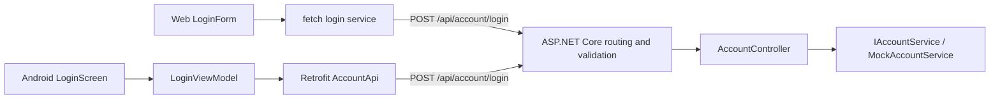

# Current architecture

Snapshot: September 2026. This document describes the code that runs today. The [design journey](arch_design_journey_as_september_10th.md) preserves the broader reasoning and future direction.

## Runtime boundaries

HomeHarmony has three applications in one repository: a Next.js web client, a native Android client, and an ASP.NET Core API. The implemented feature is mock account login. The API does not connect to a database or issue authentication credentials.

## Where the code lives

| Boundary | Entry points and responsibility |
| --- | --- |
| API startup | [`Program.cs`](../../api/Household.Api/Program.cs) registers controllers, Problem Details, OpenAPI, CORS and the scoped mock account service. |
| Account feature | [`Features/Account`](../../api/Household.Api/Features/Account) contains the request contract, controller, service interface and implementation. |
| Web | [`src/app`](../../web/src/app) owns routes; [`components/forms`](../../web/src/components/forms) owns inputs, validation and form state; [`services/auth/login.ts`](../../web/src/services/auth/login.ts) performs HTTP requests with a 15-second timeout. |
| Android | [`homeharmony`](../../mobile/app/src/main/java/io/github/bigreddog33/homeharmony) contains Compose screens, navigation, login ViewModel/state, validation and Retrofit contracts. The package/application ID is `io.github.bigreddog33.homeharmony`. |

The browser calls the API directly; Next.js is not an authentication proxy. Android calls the same endpoint through Retrofit. The request contract is represented separately in C#, TypeScript and Kotlin, without generated client code.

## Login request flow

1. Each client validates required email/password input and email format for immediate feedback. It trims the email before sending; it preserves the password.
2. `POST /api/account/login` binds JSON to `LoginRequest`. ASP.NET Core's `[ApiController]` behavior enforces the record's DataAnnotations before calling the controller.
3. `AccountController` calls `IAccountService`. The registered `MockAccountService` checks the fixed demo email (case-insensitive) and password (case-sensitive), and observes request cancellation.
4. The client shows the result or navigates to its placeholder home screen. No login state is persisted.

| Response | Meaning | Client behavior |
| --- | --- | --- |
| `200 OK`, empty body | Demo credentials matched | Navigate to home; no JSON response parsing needed |
| `400 Bad Request`, validation Problem Details | Missing or invalid input | Show input/request feedback |
| `401 Unauthorized` | Well-formed input with incorrect credentials | Show a form-level error |
| Network/server failure | Request could not complete successfully | Web Toast or Android Snackbar |

Registration password policy does not apply to login: a nonempty password is valid input even when it does not match the demo account. See [account decisions](account-login.md).

## Configuration and environments

- Web uses `NEXT_PUBLIC_API_BASE_URL` from [`web/.env.example`](../../web/.env.example). It is public browser configuration.
- API CORS permits the configured `WebClientOrigin`, defaulting to `http://localhost:3000`. Development exposes OpenAPI and developer exception output. Other environments use the exception handler and HTTPS redirection.
- Android reads `BuildConfig.API_BASE_URL`, set by Gradle's `DEBUG_API_BASE_URL` or `RELEASE_API_BASE_URL`. Debug defaults to `http://127.0.0.1:5193/` for `adb reverse`; release requires HTTPS and defaults to a deliberately nonfunctional `.invalid` address. Debug permits cleartext traffic; release does not.
- No secrets, database migrations, cookies, bearer tokens, or server-side sessions are needed for this demo. The home destinations and API are not protected by real authentication or household authorization.

## Verification

- API unit tests exercise the controller and mock service. [`AccountLoginIntegrationTests`](../../api/Household.Api.Tests/Features/Account/AccountLoginIntegrationTests.cs) uses `WebApplicationFactory<Program>` and the actual startup/DI configuration to send JSON through routing, binding, automatic validation and controller execution. It checks field-level validation Problem Details, rejected credentials, and the empty success body.
- Web Vitest tests cover validation and login-service outcomes with mocked requests.
- Android JVM tests cover validation and ViewModel state transitions with a fake account API and coroutine test dispatchers. The generated example instrumented test has been removed.
- GitHub Actions builds/tests each application; Android's Gradle build also runs lint. There is no device or browser end-to-end suite in CI.

## Next boundaries to implement

ASP.NET Core Identity, SQL Server persistence, web cookie sessions, Android tokens, household authorization, calendar/task features, real-time synchronization and deployment remain future work. These should be read as design direction, not current capabilities.
